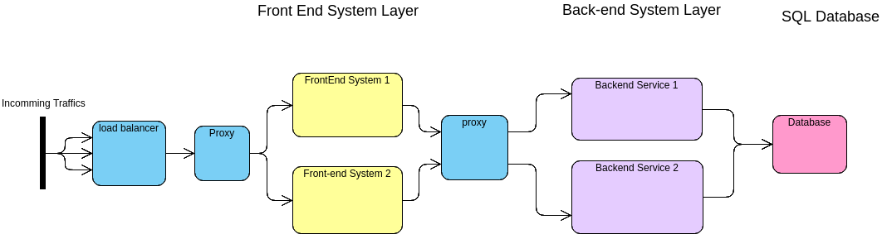

# Shop Frontend sytem

A simple shop frontend system built with Node.js and Express.js. It is used to demo a scalable web applications.

 

## Installations 
download / clone with

    git clone https://github.com/anthonyho007/shop-api-front

to install the project dependencies

    npm install

to start the server

    npm start

 

## Design

The front-end system is designed to connect to a backend service dynamically using the cluster's local DNS server to achieve high scalability, instead of having a front-end system tied to any specific backend server instance.Load When the frontend system wants to issue an API request to the backend system, it would first look up for the DNS of the target backend service then it would travel through ip tables and kubernetes proxy to arrive to the corresponding backend services for the API request.